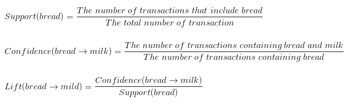

# Grocery Store Items Association

According to an article by the BBC, Tesco stated that men who buy babies nappies are likely to put cans of beer in their shopping trolley too. Research by Tesco revealed a strong link between nappies and beer purchases by male customers.

In a general sense, if it were possible for stores to get an idea of their product association rules, they could be implemented to structure the store layout in order to increase the probability of higher customer spending. For instance, if a typical customer purchases bread and milk as part of their weekly shop, seperating these products in order to maximise the distance travelled between them in store will allow customers to be exposed to a wide range of products in between. This increases the probability of customers purchasing additional products they would not have initially bought.

**Task**

Produce a machine learning model for the store under study which finds the association rules for the products sold in store. This model will be used to optimise the placement of products in store to further increase sales.

We will be analysing the shopping baskets (transactions) of customers in our dataset, learning product associations and customer behaviour. In order for us to learn these associations, we will be using the "Apriori" association rule algorithm.

## Association Rule Learning

"People who bought item X also bought item Y", "These items are frequently bought together", or "Those who watched program A also watched program B". In essence, this is what association rule learning is about.

## Apriori Algorithm

This algorithm has three parts:
- Support
- Confidence
- Lift

E.g. Let's say we own a grocery store and wish to study our customers shopping behaviour. Using the Apriori algorithm, let's analyse the association between bread and milk. The "Support", "Confidence" and "Lift" are calculated as follows:



**Note**

- If the value of lift < 1, there is no association between bread and milk. Therefore having bread in the customers basket does not increase the occurence of having milk.
- If the value of lift > 1, there is an association between bread and milk. Therefore, the higher the lift, the higher the chances of milk being picked if bread has already been picked.

**Steps to producing the Apriori algorithm**

- **Step 1:** Set a minimum support and confidence.
- **Step 2:** Take all the subsets in the transactions having higher support than minimum support.
- **Step 3:** Take all the rules of these subsets having higher confidence than minimum confidence.
- **Step 4:** Sort the rules by decreasing fit.

**Note**

Apriori is deemed a slow algorithm because it goes through all the possible combinations, for instance, all the pairs, triples ... etc in one set; we therefore set limitations. These limitations come in the form of setting minimum or maximum thresholds for the algorithm, we will observe these in the code given below.

```
# Training Apriori on the dataset

from apyori import apriori
rules = apriori(transactions, min_support = 0.003, min_confidence = 0.2, min_lift = 3, min_length = 2)

# Visualising the results

results = list(rules)
```

- The min_support is the frequency of the item in all transactions. As the dataset under study is a week's worth of data, the min_support is calulated by:
  
  - (3 products sold per day x 7 days) / 7500 total transactions = 21/7500 = 0.0028 = 0.003 (3 d.p)

- The min_confidence has been given a value of 0.2, which states that we only wish to see association rules that are at least 20% correct. In other words, a min_confidence value of 0.2 states that if item X is picked, there is a probability of 20% that item Y is picked thereafter (if we are analysing the association rule of items X and Y).

- The min_lift is set to three as values that are equal to or greater than three are interpreted as a "highly relevant" or a "high strength" rule.

- The min_length is set to 2 which states that the minimum number of items per transaction must be 2, therefore not taking single item transactions into consideration.

The rules are stored in the "results" list. To observe the strongest association rule, we input the code given below and observe the output given thereafter.

**Note**
The association rules are already sorted by their relevance which is a combination of the "Support", "Confidence" and "Lift".

```
In [1]: results[0]

Out[1]: RelationRecord(items=frozenset({'light cream', 'chicken'}), support=0.004532728969470737, ordered_statistics=[OrderedStatistic(items_base=frozenset({'light cream'}), items_add=frozenset({'chicken'}), confidence=0.29059829059829057, lift=4.84395061728395)])
```

Interpretation of the above code:

- 

### References
BBC article:   http://news.bbc.co.uk/1/hi/uk/77622.stm
Online LaTeX equation editor: https://www.codecogs.com/latex/eqneditor.php
